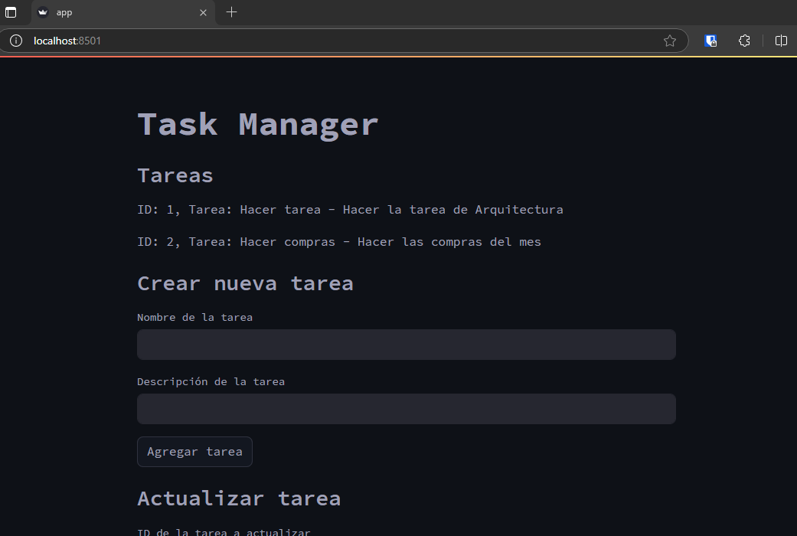
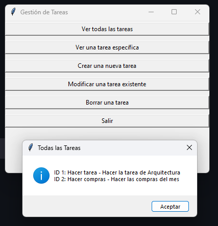

# Actividad 3 - Arquitectura Cliente Servidor

## API

```bash
GET    /tasks            ## Listar todas las tareas
GET    /tasks/<task_id>  ## Consultar una tarea
POST   /tasks            ## Crear una tarea
PUT    /tasks/<task_id>  ## Modificar una tarea
DELETE /tasks/<task_id>  ## Eliminar una tarea
```

## Instalar dependencias

```bash
pip install -r requirements.txt
```

## Variables de entorno

El archivo de variables de entorno se llama `.env` y se encutra dentro de la carpeta `client`

```bash
SERVER_API_URL="http://127.0.0.1:5000/tasks"
```

## Ejecutar

### Servidor

```bash
cd server
python server.py
```

### Cliente

```bash
cd client
streamlit run app.py ## Activar el cliente web
python client.py     ## Activar el cliente por consola - CLI
python gui_client.py ## Activar el cliente de escritorio
```

## Descripción del proyecto

El proyecto consiste en una API REST que permite realizar operaciones CRUD sobre una lista de tareas, la cual fue desarrollada en Python utilizando Flask y el cliente fue desarrollado en Python utilizando Streamlit, Tkinter y cliente por consola.

## Cliente Web

El cliente web fue desarrollado utilizando Streamlit, el cual permite realizar operaciones CRUD sobre la lista de tareas.




## Cliente de escritorio

El cliente de escritorio fue desarrollado utilizando Tkinter, el cual permite realizar operaciones CRUD sobre la lista de tareas.



## Cliente por consola

El cliente por consola fue desarrollado utilizando la librería `requests`, el cual permite realizar operaciones CRUD sobre la lista de tareas.

.png)

## Integrantes

- [Juan Diaz - 100160393](https://github.com/juandiazmoya)
- [Michel Vega - 10061117](https://github.com/mix3432)
- [Jhon Sánchez - 100122743](https://github.com/Alexsanchez-WP)
